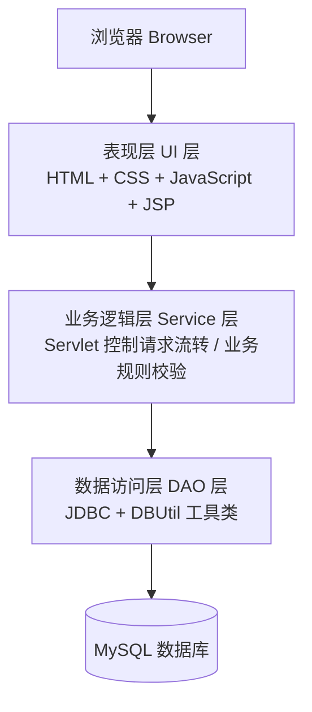
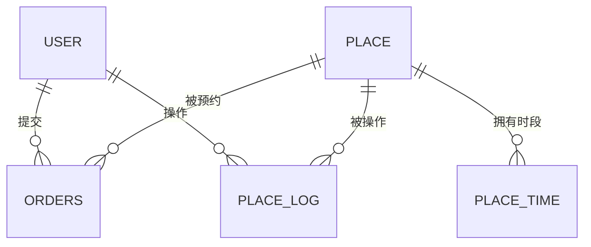

# 🏫 校园活动预约管理系统

> 基于 Servlet + JSP 的高校场地预约管理平台
> **Campus Activity Reservation Management System Based on Servlet and JSP**


---

## 📖 项目简介

传统的校园活动场地预约依赖与管理老师逐一微信沟通，存在**信息传递不及时、资源分配不合理、管理效率低下**等问题，且缺乏统一的预约记录平台，极易导致多个活动在同一时间段重复预约。

本项目基于 **Servlet + JSP** 技术，遵循 **MVC 架构模式**，以 **MySQL** 作为后台数据库，设计并实现了一套覆盖学生预约、教师审批、管理员监管的全流程线上场地预约管理系统，旨在替代传统人工沟通与线下登记模式，简化预约审批流程，避免场地冲突，提高场地利用率与管理效率。

---

## ✨ 核心功能

### 👨‍🎓 学生端
- 账号登录，仅查看 / 操作本人权限范围内的功能
- 浏览全部教室信息（位置、容量、设备、开放时间）
- 查看场地实时占用状态，按时间段直观区分可预约 / 已占用
- 在线填写活动名称、时间段、备注并提交预约申请
- 查看个人预约记录及审核状态（待审核 / 已通过 / 已驳回 / 已取消）
- 审核通过前可自主取消预约

### 👨‍🏫 教师端
- 账号登录，仅操作本人权限范围内功能
- 查看全部学生预约申请，进行通过 / 驳回操作，结果自动同步给学生
- 查看教室详细信息（编号、容量、楼栋、配套设施）
- 对教室信息进行新增、编辑、删除等全流程管理
- 查看全部预约记录，统筹场地使用情况

### 🛠️ 管理员端
- 专属账号登录，保障管理权限唯一性
- 学生 / 教师账号全生命周期管理（增、删、查、改）
- 查看全部预约申请及教师审批记录，监督预约流程
- 查看教师对教室的全部操作日志，实现操作可追溯

---

## 🏗️ 系统架构

系统采用 **B/S 架构**，划分为表现层、业务逻辑层、数据访问层三层，各层职责清晰、低耦合：



| 层级 | 技术对应 | 职责 |
| --- | --- | --- |
| 表现层（View） | JSP | 接收用户输入、展示数据、生成动态页面 |
| 业务逻辑层（Controller） | Servlet | 接收 HTTP 请求、调用业务处理、决定视图跳转 |
| 数据访问层（Model） | JavaBean + JDBC | 数据存储、业务规则处理、数据库读写 |

---

## 🧰 技术栈

| 分类 | 技术选型 |
| --- | --- |
| 开发语言 | Java (JDK 1.8) |
| 后端框架 | Servlet、JSP、JDBC |
| 架构模式 | MVC、三层架构（表现层 / 业务逻辑层 / 数据访问层） |
| 数据库 | MySQL 5.7 |
| Web 服务器 | Apache Tomcat 9.0 |
| 前端技术 | HTML、CSS、JavaScript |
| 开发工具 | Eclipse |

---

## 📂 项目目录结构

```text
campus-reservation-system
├── src/main/java
│   ├── com.dao                 # 数据访问层
│   │   ├── OrderDao.java       # 预约订单数据操作
│   │   ├── PlaceDao.java       # 场地信息数据操作
│   │   ├── PlaceTimeDao.java   # 场地时段数据操作
│   │   └── UserDao.java        # 用户信息数据操作
│   ├── com.entity               # 实体类层
│   │   ├── Order.java
│   │   ├── Place.java
│   │   ├── PlaceTime.java
│   │   └── User.java
│   ├── com.servlet              # 业务控制层
│   │   ├── LoginServlet.java / LogoutServlet.java / RegisterServlet.java
│   │   ├── AddOrderServlet.java / CancelOrderServlet.java / CheckOrderServlet.java
│   │   ├── AddPlaceServlet.java / DeletePlaceServlet.java / datePlaceServlet.java
│   │   └── StudentServlet.java / TeacherServlet.java
│   ├── com.servlet.admin        # 管理员专属控制层
│   │   ├── AddUserServlet.java
│   │   ├── DelUserServlet.java
│   │   └── UpdateUserServlet.java
│   └── com.util
│       └── DBUtil.java          # 数据库连接工具类
└── src/main/webapp
    ├── admin/                   # 管理员端页面
    ├── student/                 # 学生端页面
    ├── teacher/                 # 教师端页面
    └── WEB-INF/                 # 登录、注册等公共页面
```

---

## 🗄️ 数据库设计

系统采用 MySQL 存储用户、场地、预约及操作日志数据，核心实体共 5 张表，均为一对多（1:N）关联关系：



| 数据表 | 说明 |
| --- | --- |
| `user` | 存储学生 / 教师 / 管理员的账号、密码、姓名及角色信息 |
| `place` | 存储教室名称、设备、容量、开放时间、使用状态等场地信息 |
| `place_time` | 存储各场地按日期划分的可预约时段及占用状态 |
| `orders` | 存储学生预约申请的事由、时段、审核状态等信息 |
| `place_log` | 记录教师对场地信息新增 / 编辑 / 删除的操作日志 |

> 完整字段定义、数据类型与约束条件详见毕业论文第 4.4.2 节「数据表结构」。

---

## 🚀 快速开始

### 环境要求

- JDK 1.8+
- Apache Tomcat 9.0+
- MySQL 5.7+
- Eclipse（或其他支持 Servlet/JSP 的 IDE）

### 部署步骤

```bash
# 1. 克隆项目
git clone https://github.com/<your-username>/<your-repo>.git

# 2. 创建数据库并导入项目提供的 SQL 脚本
mysql -u root -p < sql/campus_reservation.sql
```

3. 修改 `com.util.DBUtil` 中的数据库连接信息（URL、用户名、密码）为本地配置；
4. 在 Eclipse 中将项目导入为 **Dynamic Web Project**，并关联 Tomcat 9 运行环境；
5. 启动 Tomcat，浏览器访问 `http://localhost:8080/项目名/`，进入登录页面即可开始使用。

> 💡 数据库脚本路径、JDBC 连接参数请根据实际项目文件结构自行调整。

---

## 🧪 功能测试

系统采用黑盒测试方法，对核心业务功能进行了全面验证，主要测试模块及结论如下：

| 测试模块 | 测试内容 | 结果 |
| --- | --- | --- |
| 登录测试 | 正确 / 错误账号密码登录、角色跳转 | ✅ 通过 |
| 场地管理测试 | 新增、修改、删除、查询教室信息 | ✅ 通过 |
| 预约申请测试 | 正常预约、时间冲突校验、取消预约 | ✅ 通过 |
| 预约审核测试 | 审批通过 / 驳回及状态同步 | ✅ 通过 |
| 查询测试 | 学生 / 教师 / 管理员分角色数据查询 | ✅ 通过 |

详细测试用例请参见毕业论文第 6 章「系统测试」。

---

## 📌 不足与未来展望

**当前不足**
- 页面交互体验与成熟商业 Web 应用相比仍有差距
- 缺少场地预约提醒、预约统计报表等拓展功能
- 采用 Servlet+JSP 经典组合，尚未引入前后端分离架构
- 通用性与外部系统集成能力有限

**未来规划**
- 优化界面设计，提升交互体验与视觉表现
- 增加预约提醒、数据统计报表等实用功能
- 探索迁移至 Spring Boot + Vue.js 等前后端分离架构

---

## 👤 作者信息

- **学生**：董峰煜（学号 202205710405）
- **专业**：信息管理与信息系统
- **学院**：管理学院
- **学校**：浙江工业大学
- **指导老师**：马修岩

本项目为本科生毕业设计（论文）配套代码仓库，仅供学习与交流使用。

---

## 📄 License

本项目采用 [MIT License](LICENSE) 开源协议，可自由用于学习与非商业用途。
